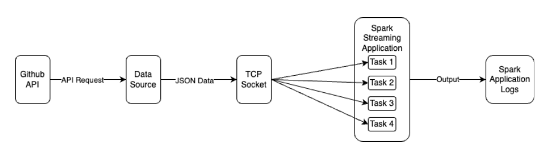

## GitHub Repository Streaming Analytics

This project is designed to stream repository data from the GitHub API, process the data in real-time using PySpark Streaming, and present analytics on terminal output. The system employs Docker to manage dependencies and streamline deployment.

### Project Overview

This streaming application fetches data from the GitHub API based on specific programming languages, processes the stream for various analytics like the total number of repositories per language, recent pushes, average star count, and top frequent words in descriptions.

### System Architecture



- **data_source.py**: Fetches the repository data from GitHub API and streams it over a TCP socket.
- **spark_app.py**: Utilizes PySpark to process the streamed data and compute the desired analytics.
- **docker-compose.yaml**: Docker configurations to containerize and manage the application components.

### Prerequisites

- Docker and Docker Compose installed.
- An active internet connection.
- A personal access token from GitHub for API requests. [Create a token here](https://github.com/settings/tokens).

### Setup & Configuration

1. **Clone the Repository**
   
    ```bash
    git clone [YOUR_GITHUB_REPO_LINK]
    cd [YOUR_PROJECT_DIRECTORY]
    ```

2. **Environment Configuration**

   Before starting the containers, make sure you set up the GitHub personal access token:

    ```bash
    export TOKEN=YOUR_GITHUB_PERSONAL_ACCESS_TOKEN
    ```

3. **Build and Start the Docker Containers**

    ```bash
    docker-compose up --build
    ```

   This command will pull necessary Docker images, build the Docker containers, and start the application.

4. **Monitor the Application**

   - Open a web browser and navigate to `http://localhost:8080` to access the Spark Master web UI. Here, you can monitor the progress and performance of your Spark Streaming application.
   - The terminal will display the analytics results based on the computations done in `spark_app.py`.

5. **Shutting Down**

   To gracefully shut down the system, use:

    ```bash
    docker-compose down
    ```

### Troubleshooting

- **Rate Limits**: GitHub API has rate limits for unauthorized and authorized requests. Ensure your token is correctly set up to avoid hitting the limits quickly.
- **Docker Issues**: Ensure that Docker and Docker Compose are properly installed and that you have sufficient privileges to start and stop Docker containers.

### Future Enhancements

- Implement a web-based dashboard for better visualization of analytics.
- Optimize the data-fetching module to respect GitHub's rate limits more efficiently.
- Integrate more data sources for richer analytics.

### Contributing

Pull requests are welcome! For major changes, please open an issue first to discuss the desired change.
